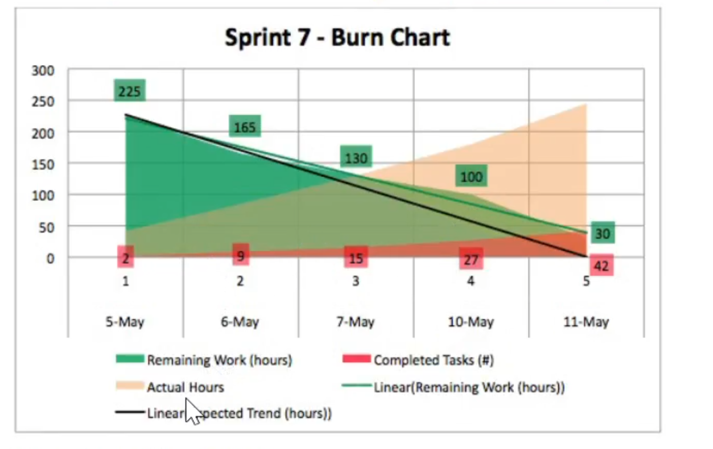

# Question 40

What are possible benefits from practicing Test-Driven Development?
(choose the best three answers)

- [x] A It helps break down complex problems into smaller ones that are much easier to
be tackled.
- [x]  B. It helps to identify gaps in understanding the desired behavior.
- [ ] C. It increases collaboration between Developers as it requires Pair Programming-
- [ ] D. It is a great way for Testers to contribute early in the Sprint as they can start
creating all the tests from the beginning on.
- [ ] E. It makes Integration Tests obsolete and by doing so saves a lot of time.
- [x]   F. It might lead to better code as refactoring is part of the Test-Driven Development
cycle.

# Question 41

Which of the following describe Test-Driven Development?
(choose the best two answers)

- [x]  A. A software development technique based on automated tests.
- [ ] B. Having testers involved in the development process.
- [x]  C. An incremental and emergent approach to software design.
- [ ] D. A predictable way to develop working, well-organized code.
- [ ] E. Creating a manual test script before writing code.

# Question 42

Which of the following describe Test-Driven Development?
(choose the best two answers)
- [x]  A. A software development technique based on automated tests.
- [ ] B. Having testers involved in the development process.
- [x]  C. An incremental and emergent approach to software design.
- [ ] D. A predictable way to develop working, well-organized code.
- [ ] E.Creating a manual test script before writing code.

# Question 43

Which statement best describes a Product Owner's responsibility?
(choose the best answer)

- [ ] A. Keep stakeholders from distracting the Developers.
- [ ] B. Directing the Developers.
- [ ] C. Ensuring that the work meets the commitments to the stakeholders.
- [x]  D. Maximizing the value of the work the Scrum Team does.

# Question 44
Based on "Sprint 7 Burn-Down Chart" would you do anything different in Sprint 89

(choose the best two answers)

- [ ] A. The Scrum Master adds additional Developers for Sprint 8.
- [ ] B. The Developers carryover incomplete Sprint Backlog items from Sprint 7 to
Sprint 8 and monitor the Sprint 8 burn-down chart. As soon as deviation from
trends is detected, the Developers work with the Product Owner to negotiate
remaining work.
- [ ] C. There is nothing wrong. The Developers will present all oduct Backlog items
selected for Sprint 7 at the end of the Sprint.
- [x] D. The Developers may forecast less overall work in Sprint 8.
- [ ] E. Stakeholders will encourage the Scrum Team to estimate better during the Sprint
8 Planning Meeting.
- [x] F. The Developers put incomplete Product Backlog items back into the Product
Backlog for re-ordering. The Product Owner may ask the Developers to
complete the unfinished Product Backlog items from Sprint 7 in Sprint 8.

# Question 45

True or False: Only technical writers can create documentation during a Sprint.

- [ ] True
- [x] False

# Question 46

The Sprint is already underway. A Product Backlog item selected for the Sprint is unclear. What
two things could the Developers doQ
(choose the best two answers)
a
- [ ] A. Skip the item until the next Sprint.
- [x] B. Reach out to the Product Owner for the missing information before proceeding.
- [ ] C. Reach out to specialists in the product management department for the missing
information.
- [x] D. Make their best guess and proceed to avoid any delays.
- [ ] E. With the Product Owner's help, move the unclear work into a new Product
Backlog item and place it on the Product Backlog.

# Question 47

Who creates tests on a Scrum Team?
(choose the best answer)

- [x] A. The Developers.
- [] B. The Product Owner.
- [] C. The Scrum Master
- [] D. Quality Assurance Specialists.

# Question 48

True or False: Cross-functional teams are optimized to work on one component or layer of a
system only.
- [] True
- [x] False

# Question 49

Which of the following are quality goals in application architecture?
(choose the best two answers)

- [x] A. scability.
- [] B. Build-
- [x] C. Security.
- [x] D. Design pattern selection.

# Question 50

True or False: Product documentation may be required as part of a working Increment.
- [x] True
- [] False

# Question 51

Choose two benefits of Continuous Integration.
(choose the best two answers)

- [x] A It leads to higher transparency and rapid feedback for the team.
- [] B It eliminates bugs completely.
- [x] C. It can increase collaboration within the Developers.
- [] D. The build is executed once every night and at least once each weekend.

# Question 52

Choose four desirable characteristics of a unit test.
(choose the best four answers)
- [] A. Includes exercising the persistence layer
- [x] B. Makes assertions about only one logical concept.
- [x] C. Test code is as small as possible.
- [x] D. Independent of others.
- [x] E. Execution is fast.

# Question 53

When using Continuous Integration, how often should the build be executed?
(choose the best answer)

- [] A. Once per day-
- [] B. Whenever new tests are created or uncertainty arises about whether Old tests will
pass
- [] C. Once per hour.
- [] D. Before the end of the Sprint.
- [x] E. Whenever new or changed code is checked into version control.

# Question 54

Who is responsible for a Sprint Backlog item that contains several database related tasks?
(choose the best answer)
 
- [x] A. Developers.
- [] B. Product Owner.
- [] C. Scrum Master.
- [] D. Project Stakeholders.
- [] E. Database administrator.

# Question 55 TODO

Why is architectural layering important for emergent systems?
(choose the best three answers)

- [x] A. Layering separates different logical concerns within the system.
- [x] B. Layering increases maintainability of a system by isolating functional
responsibilities.
- [] C. Layering assigns clear responsibilities to individual Developers.
- [x] D. Layering makes it easier to reuse functionality.

# Question 56

What is a unit test?
(choose the best answer)

- [] A. A way to ensure product code satisfies the user requirements.
- [] B. A technique for ensuring that units of co-dependent systems integrate correctly.
- [x] C. A test that isolates and verifies individual units of functionality.
- [] D. A test that ensures a specific method integrates properly with the code calling it-

# Question 57

Which answer best describes Behavior-Driven Development (BDD)?
(choose the best answer)

- [] A. A development style that accounts for leadership style among team members.
- [] B. A way to organize unit tests based on class and method structures.
- [] C. A technique for maintaining regression test harnesses.
- [x] D. An agile practice that encourages collaboration between business, implementation
and testing perspectives.

# Question 58

What are two reasons to use mock objects in unit tests?
(choose the best two answers)

- [x] A. The behavior of a given object can be emulated to the system under test.
- [] B. They are machine-generated a d eliminate the need to write code by hand.
- [x] C. Isolating a particular system component for controlled testing.
- [] D. TDD is impossible without them.
- [] E. To decrease cyclomatic complexity.

# Question 59 TODO C

Is it a good idea to follow each automated build with the execution of automated tests?
(choose the best answer)

- [x] A. Yes- The tests may identify whether there are problems that the Developers should
fix before proceeding.
- [] B. No. It would take too much time.
- [] C. No. Automated tests should only be executed when the implementation of a Product
Backlog item is complete.
- [] D. Yes- Code coverage can be used to assess progress.

# Question 60

True or False: User Stories are required in the Product Backlog.

- [] True
- [x] False

# Question 61

Why do the Developers need a Sprint Goal?
(choose the best answer)

- [] A. A Sprint Goal ensures that all of the Product Backlog items selected for the Sprint are
implemented.
- [] B. Sprint Goals are not valuable. Everything is known from
- [] C. A Sprint Goal only gives purpose to Sprint 0.
Product Backlog.
- [x] D. The Developers are more focused with a common yet specific goal.

# Question 62

Who decides the system architecture of a product developed using Scrum?
(choose the best answer)

- [] A. The Chief Architect.
- [] B. The Architect chosen by the Scrum Team.
- [] C. The software architect assigned to the Scrum Team.
- [x] D. The Developers with input from the Scrum Team and others.

# Question 63

When a Continuous Integration build fails, who ideally fixes it?
(choose the best answer)

- [] A. The person assigned to the configuration management role within the team.
- [] B. The next person who needs the build to complete successfully.
- [] C. The tester responsible for validating builds.
- [] D. The person who broke the build-
- [x] E. Whoever the Developers agree should fix it.

# Question 64

What is the primary purpose of refactoring?
(choose the best answer)

- [] A. Ensuring that all factors are constantly aligned.
- [] B. Removing all bugs that were found during regression tests.
- [x] C. Making sure that the code is readable and maintainable.
- [] D. Creating better technical documentation.

# Question 65

What is Pair Programming?
(choose the best answer)

- [] A. Developers that are able to write code both in the back-end and the front-end-
- [] B. Two persons working on the same Product Backlog item trying to get it done as soon
as possible.
- [x] C. Two Developers working on the same problem, at the same computer
ysically or virtually), at the same time.
- [] D. A Tester and a Developer working together to ensure high quality.

# Question 66

Which statement best describes the Sprint Backlog as the output of the Sprint Planning?
(choose the best answer)
- [] A. Every item has a designated owner.
- [] B. It is ordered by the Product Owner.
- [] C.It is the Developers plan for the Sprint.
- [] D. Each task is estimated in hours.
- [x] E. It is a complete list of all work to be done in a Sprint..

# Question 67

Which describes the pratice of expressing reguirements as acceptance tests
(choose the best answer

- [] A. regression testing
- [] B. Objet-Driven requirements Definition
- [x] C. Acceptance Test-Driven Development
- [] D. Quality Oriented requirements Definition

# Question 68

What is a merge in a version control system
(choose the best answer)

- [x] A. Combining two or more versions of code into a single codebase
- [] B. identify a particular codebase as ready for distribution
- [] C. Copying a portion of a code base to isolate at from the orignal codebase
- [] D. Triggering a development into production

# Question 69

True or False: Stakeholders can be included in Product Backlog refinement

- [x] True
- [] False

# Question 70

Choose three reasons Why automated builds are important?
(choose the best three answers)

- [x] A. They allow frequent validation and ensure the product remains in a usable state.
- [] B. They eliminate the need for Build Engineers.
- [x] C. They support Continuous Integration.
- [x] D. They clearly define the build process.
- [] E. They ensure your product remains bug free.

# Question 71

While practicing Test-Driven Development, what is done after the test fails?
(choose the best answer)

- [] A. Run it again to make sure it really fails-
- [] B. Implement the required functionality.
- [x] C. Write the minimum amount of product code to satisfy the test.
- [] D. Meet with the business analyst to ensure that the test is correct.
- [] E. Refactor the test so the code passes.

# Question 72

Which three of the following are code quality metrics?
(choose the best three answers)

- [] A. Unit tests per class.
- [] B. Number of check-ins per day.
- [x] C. Class coupling.
- [x] D. Cyclomatic complex
- [] E. Cycle time per Product Backlog item.
- [x] F. Depth of inheritance.

# Question 73

When should Product Backlog refinement occur  ?
(choose the best answer)

- [] A. Only during refinement meetings planned by the Product Owner.
- [x] B. Anytime the Scrum Team feels Product Backlog items require more preci
- [] C. Only during Sprint Planning.
- [] D. Always prior to Sprint Planning.

# Question 74

The Scrum Team should have all the skills needed to:
(choose the best answer)
- [x] A. Turn Product Backlog items into a valuable, useful Increment.
- [] B. Complete the project within the date and cost as calculated by the Product Owner.
- [] C. Do all of the development work, except for specialized testing that requires additional
tools and environments.

# Question 75

You are asked to refactor part of the codebase for Application X. When you are done, all unit
tests pass with 50% code coverage. What can you infer from this?
(choose the best answer)

- [x] A. You did not break any existing unit tests.
- [] B. At least 50% of Application X functions correctly.
- [] C. There are no bugs present in Application X.
- [] D. Less than 50% of Application X functions correctly.

# Question 76

Which statements are true when multiple Scrum Teams work on a software product at the same
time ?
(choose the best two answers)
C)
- [x] A. The Scrum Teams coordinate their work to deliver a single Increment.
- [] B. Each Scrum Team should have a different Product Owner.
- [x] C. The Scrum Teams must integrate their work before the end of the Sprint.
- [] D. Code is merged at the Scrum of Scrums.
- [] E. All Scrum Teams work in their own version control branch.

# Question 77

When is a system's architecture decided?
(choose the best answer)

- [] A. Before writing code.
- [] B. ln the beginning of the project, during Sprint 0.
- [] C. It is designed along with the vision, before the first Sprint.
- [x] D. Throughout development, as understanding emerges.

# Question 78

When is refinement of a Product Backlog item completeQ
(choose the best answer)

- [x] A. When the Scrum Team agrees it is precise enough.
- [] B. At the end of Sprint Planning.
- [] C. When the Product Backlog Refinement timebox expires.
- [] D. When the Product Owner says it is ready.

# Question 79

Why are automated builds important?
(choose the best answer)

- [] A. You are unable to check-in code without one.
- [] B. They are part of your Definition of Done.
- [] C. Without them you cannot tell if your code works.
- [x] D. They help you find defects and configuration management issues arlier.

# Question 80

Which three of the following criteria are most helpful as part of a Scrum Team's Definition of
Done?
(choose the best three answers)
- [x] A. Code review is done.
- [x] B. Regression tests pass.
- [] C. The product is released at the end of every Sprint.
- [] D. No impediments exist.
- [x] E. Acceptance tests pass.

(choose the best two answers)
A. The Scrum Master adds additional Developers for Sprint 8.
B. The Developers carryover incomplete Sprint Backlog items from Sprint 7 to
Sprint 8 and monitor the Sprint 8 burn-down chart. As soon as deviation from
trends is detected, the Developers work with the Product Owner to negotiate
remaining work-
C. There is nothing wrong. The Developers will present all Product Backlog items
selected for Sprint 7 at th nd of the Sprint
D. The Developers may forecast less overall work in Sprint 8_
E. Stakeholders will encourage the Scrum Team to estimate better during the Sprint
8 Planning Meeting.
F. The Developers put incomplete Product Backlog items back into the Product
Backlog for re-ordering- The Product Owner may ask the Developers to
complete the unfinished Product Backlog items from Sprint 7 in Sprint 8.

